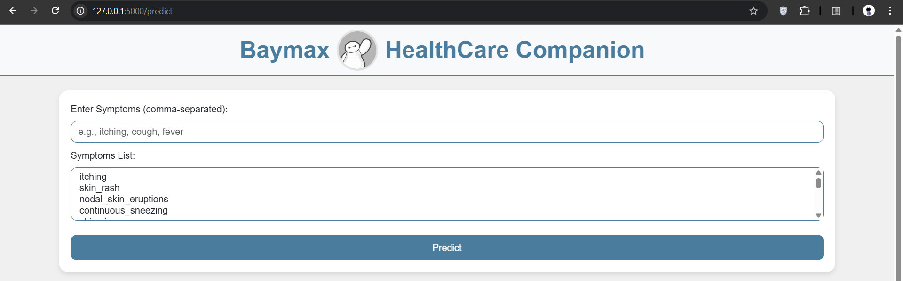

# Baymax - HealthCare Companion
Baymax is a healthcare system designed to predict diseases based on user-provided symptoms. Inspired by the friendly healthcare robot from Big Hero 6, Baymax aims to provide a user-friendly, accessible, and informative platform for health monitoring and disease prediction. By leveraging machine learning and data-driven insights, Baymax helps users understand potential health issues, take preventive measures, and make informed decisions about their well-being. It supports a wide range of symptoms and diseases, from common conditions like fungal infections and allergies to more serious illnesses such as diabetes, hypertension, and heart disease. Baymax not only predicts the disease but also provides detailed information about it, including its description, precautions, recommended medications, diets, and workout plans.




## How it Works :

### Data Preprocessing:
1. The system uses a dataset (Training.csv) containing symptoms and corresponding diseases.
2. Symptoms are encoded into a binary format, and diseases are labeled for training the model.

### Model Training:
1. The machine learning model is trained using the preprocessed data.
2. Multiple models (SVC, Random Forest, Gradient Boosting, K-Nearest Neighbors, and Multinomial Naive Bayes) are evaluated, and the best-performing model (SVC) is selected.

### Real-Time Prediction:
1. Users input their symptoms via the web interface.
2. The system processes the symptoms, predicts the disease, and provides detailed information about the disease, including precautions, medications, diets, and workout plans.


## Files in the Project :

### Datasets :
1. Training.csv: Contains symptoms and corresponding diseases for training the model.
2. symtoms_df.csv: Maps symptoms to their descriptions.
3. precautions_df.csv: Lists precautions for each disease.
4. workout_df.csv: Provides workout recommendations for each disease.
5. description.csv: Contains descriptions of each disease.
6. medications.csv: Lists medications for each disease.
7. diets.csv: Provides diet recommendations for each disease.

### model_train.ipynb:
1. A Jupyter Notebook for training and evaluating the machine learning model.
2. Includes data preprocessing, model training, and evaluation steps.

### Trained Model:
1. svc.pkl: The trained Support Vector Classifier (SVC) model used for disease prediction.

### main.py :
1. The main Flask application that handles the web interface and disease prediction.
2. Loads the trained model and provides the user interface for symptom input and result display.


## Setting up the Project :

### 1. Clone the Repository
```sh
git clone https://github.com/NaynaChavda/Baymax.git
```

### 2. Navigate to the Project Directory
```sh
cd Baymax
```

### 3. Create a Virtual Environment (Optional but Recommended)
```sh
python -m venv venv
```
Activate it:
For Windows:
```sh
venv\Scripts\activate
```
For Mac/Linux:
```sh
source venv/bin/activate
```

### 4. Install Dependencies
```sh
pip install -r requirements.txt
```

### 5. Run the Application
```sh
python main.py
```

### 6. Viewing Results
1. On the web interface, enter your symptoms as a comma-separated list (e.g., itching, skin_rash, joint_pain).
2. Alternatively, select symptoms from the dropdown menu.
3. Click "Predict" to get the results.
